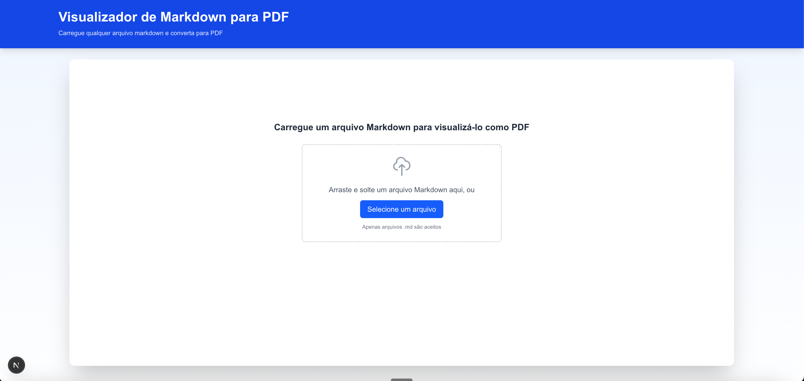
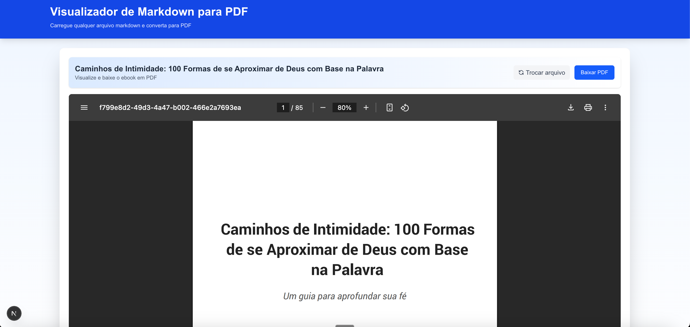

# Visualizador de Markdown para PDF

<p align="center">
  
</p>

Esta aplicação web permite carregar qualquer arquivo Markdown e convertê-lo em um PDF formatado profissionalmente. Ideal para transformar documentação, artigos ou qualquer conteúdo em Markdown em PDFs para compartilhamento ou publicação.

## 🌟 Demonstração

<p align="center">
  
</p>

## ✨ Funcionalidades

- 📤 Upload de arquivos Markdown via drag-and-drop ou seleção de arquivo
- 👁️ Visualização instantânea do PDF gerado diretamente no navegador
- 💾 Download do PDF gerado para uso offline
- 📱 Interface responsiva e amigável
- 🎨 Layout profissional com suporte a títulos, listas, citações e divisores

## 🛠️ Tecnologias Utilizadas

- [Next.js 15](https://nextjs.org/) - Framework React para desenvolvimento web
- [React 19](https://react.dev/) - Biblioteca JavaScript para interfaces de usuário
- [React-PDF](https://react-pdf.org/) - Biblioteca para geração e exibição de PDFs
- [Tailwind CSS](https://tailwindcss.com/) - Framework CSS para design responsivo
- [Marked](https://marked.js.org/) - Parser de Markdown para JavaScript

## 🚀 Instalação

```bash
# Clone o repositório
git clone https://github.com/PedroWesley/markdown-pdf.git
cd markdown-pdf

# Instale as dependências
npm install

# Execute em desenvolvimento
npm run dev
```

O servidor de desenvolvimento será iniciado em `http://localhost:3000`.

## 📖 Como Usar

1. Acesse a aplicação no seu navegador
2. Arraste e solte um arquivo Markdown na área designada, ou clique no botão para selecionar um arquivo
3. O arquivo será processado automaticamente e o PDF será exibido na visualização
4. Utilize o botão "Baixar PDF" para salvar o documento gerado no seu computador
5. Para trocar o arquivo, clique em "Trocar arquivo" e selecione um novo documento Markdown

## 📚 Suporte a Markdown

A aplicação suporta os seguintes elementos Markdown:

- Títulos (H1, H2, H3, etc.)
- Texto em negrito, itálico
- Listas ordenadas e não-ordenadas
- Citações (blockquotes)
- Divisores horizontais
- Parágrafos formatados

## 🏗️ Estrutura do Projeto

```
/
├── public/                  # Arquivos estáticos
├── src/
│   ├── app/                 # Configuração da aplicação Next.js
│   ├── components/          # Componentes React
│   │   ├── DownloadPDF.tsx  # Componente para download do PDF
│   │   ├── EbookViewer.tsx  # Visualizador principal
│   │   ├── MarkdownUploader.tsx # Componente de upload
│   │   └── PDFDocument.tsx  # Definição do layout do PDF
│   ├── services/            # Serviços da aplicação
│   │   └── ebookService.ts  # Processamento de arquivos
│   └── utils/               # Utilitários
│       └── markdownParser.ts # Conversor de Markdown para estrutura do PDF
└── package.json             # Dependências e scripts
```

## 🔧 Implantação em Produção

Para construir o projeto para produção:

```bash
npm run build
npm start
```

Para implantar no Vercel:

```bash
npm install -g vercel
vercel
```

## ⚠️ Limitações

- Apenas arquivos Markdown (.md) são suportados
- O tamanho máximo do arquivo pode ser limitado pelo navegador
- Alguns recursos avançados de Markdown (como tabelas complexas ou código com highlight) podem ter suporte limitado

## 🤝 Contribuições

Contribuições são bem-vindas! Sinta-se à vontade para abrir issues ou enviar pull requests.

1. Faça um fork do projeto
2. Crie uma branch para sua feature (`git checkout -b feature/nova-funcionalidade`)
3. Faça commit das suas alterações (`git commit -m 'Adiciona nova funcionalidade'`)
4. Faça push para a branch (`git push origin feature/nova-funcionalidade`)
5. Abra um Pull Request

## 📝 Licença

Este projeto está licenciado sob a licença MIT - veja o arquivo LICENSE para mais detalhes.

## 🧑‍💻 Autor

[Pedro Wesley](https://github.com/PedroWesley)
